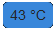

# yasb-hwinfo-widget

A widget for yasb (Yet Another Status Bar) that reads values written in the registry by HWiNFO.

## Installation

1. Download this repository
2. Copy the `widgets` and `validation` folders into `path/to/yasb/src/core`
3. Update your `config.yaml` (See usage below)

## Usage

First you need to setup HWiNFO so that it writes its values to the registry, for that you can follow [this guide](https://docs.rainmeter.net/tips/hwinfo/).

At the end of your `config.yaml` file add the following:

```yaml
  gpu_temperature: # The name of the widget
    type: "hwinfo.monitor.Monitor"
    options:
      label: "{info[value]}"
      # ^ The format label for the widget. Accepts: string containing any of the below {info} format options
        # info[sensor] - The name of the top level sensor
        # info[label] - The name of the individual sensor element
        # info[value] -  A formatted version of the number value. Formatting will include commas for thousands separators, and the text value for the unit of measure.
        # info[valueRaw] - A raw, unformatted version of the number value
        # info[color] - The color chosen in the 'Logitech LCD' tab in HWiNFO
      label_alt: "{info[sensor]} | {info[label]} | {info[value]} | {info[valueRaw]}"
        # ^ The alternate format label for the widget. Accepts: string
      update_interval: 2000 # How frequently it reads the values from registry (in milliseconds). Accepts: positive integer between 1 and 60000
      index: 3 # The index assigned to the sensor, you can check it by executing the following command in a command prompt: reg query HKEY_CURRENT_USER\SOFTWARE\HWiNFO64\VSB. Accepts: positive integer between 0 and 10000. Required field.
      class_name: "GPU_temp" # The CSS class name of the custom widget. Accepts: string. Required field.
      callbacks:
        on_left: "toggle_label" # Toggles between 'label' and 'label_alt'
        on_middle: "do_nothing"
        on_right: "do_nothing"
```

Finally add the widget in your bar:

```yaml
  bars:
    yasb-bar:
      widgets:
        right: ["gpu_temperature"]
```

### Styling

It is possible to style the label of the widget in the `styles.css` file.

```css
  .hwinfo.widget_name .label { /* where widget_name is the class_name of the widget */
    padding: 2px 4px;
    font-size: 14px;
    border-radius: 5px;
    background: #32b51a;
  }
```

## Example



`config.yaml`

```yaml
    widgets:
      cpu_temp:
        type: "hwinfo.monitor.Monitor"
        options:
          label: "{info[value]}"
          update_interval: 2000
          index: 3
          class_name: "CPU_temp"
```

`styles.css`

```css
  .hwinfo.CPU_temp .label {
    padding: 2px 4px;
    font-size: 14px;
    border-radius: 5px;
    background: #3987da;
  }
```
